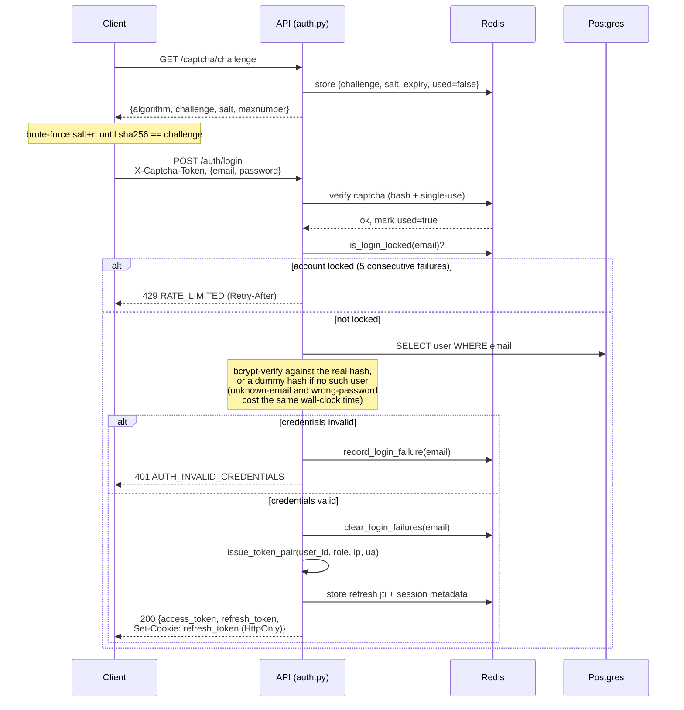
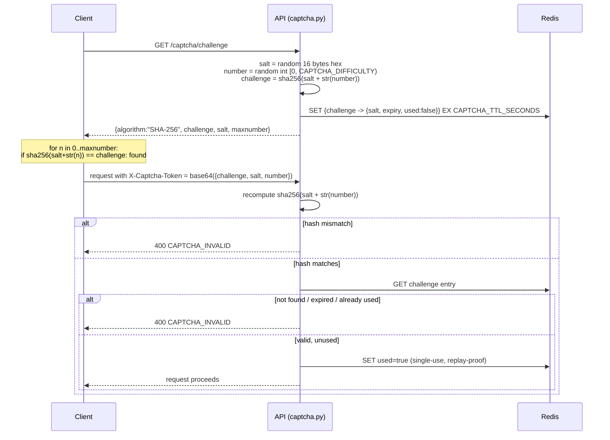
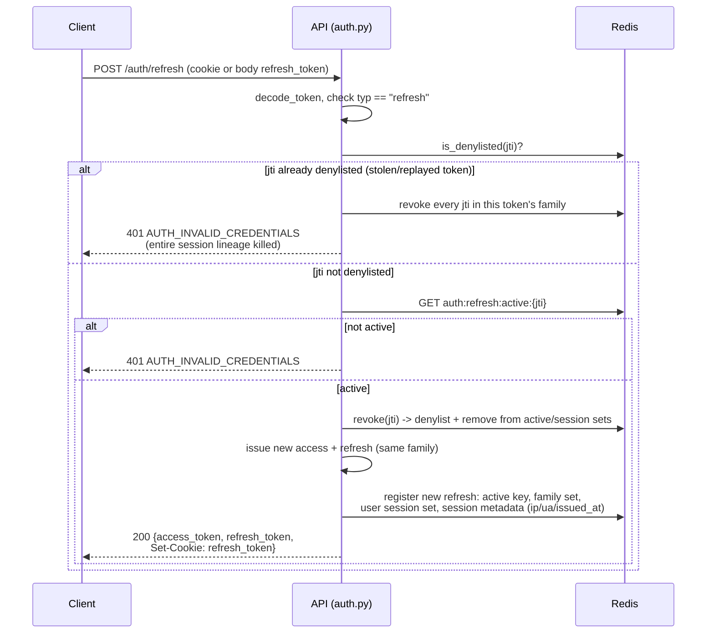
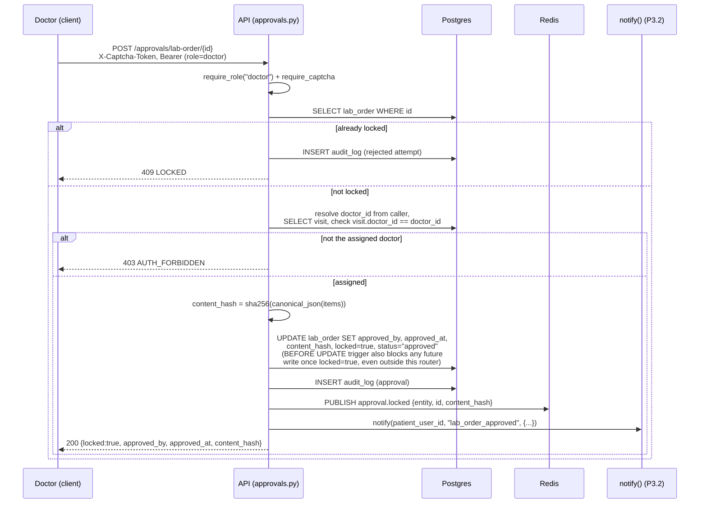

# Authentication Flows

Sequence diagrams for the four core auth flows: login, captcha, refresh
rotation, and doctor approval-lock. See [`CAPTCHA.md`](CAPTCHA.md) for the
captcha algorithm itself and [`SECURITY.md`](SECURITY.md) (CP4) for the
threat model behind each control shown here.

## 1. Login (captcha-gated, uniform-timing)

## 2. Captcha challenge/solve/verify

## 3. Refresh token rotation + reuse detection

## 4. Doctor approval + immutable lock

